# **Finding Lane Lines on the Road** 

## Xinlin's report

---

**Finding Lane Lines on the Road**

The goals / steps of this project are the following:
* Make a pipeline that finds lane lines on the road
* Reflect on your work in a written report

---

# Reflection

## 1. Describe your pipeline. As part of the description, explain how you modified the draw_lines() function.

### The pipeline described in this report consisted of *5 basic steps* and *5 extra steps*. The basic steps are very smilar with the standard lane detection pipeline of project 1. To conquer the challenge.mp4, I modified the draw_lines() function and added 5 extra steps in it.

1. Convert the images from **RGB** space to **HSV** space, and use **V channel** instead of **grayscale** image.

  ```python
  # Convert image color space to HSV space
  HSV = cv2.cvtColor(image, cv2.COLOR_RGB2HSV)

  H = HSV[:,:,0]
  S = HSV[:,:,1]
  V = HSV[:,:,2]
  ```

  * Reason:
  In my initial solution, I use grayscale image. However, it works very bad in the challenge part. I found that the grayscale image can not provide enough gradient information to distinguish the lane from background in this scenario. Especially after gaussian blur. So I decided to switch to HSV space.

  * The intensity of the grayscale image and the V channel image were plotted along these three lines to show the difference.
  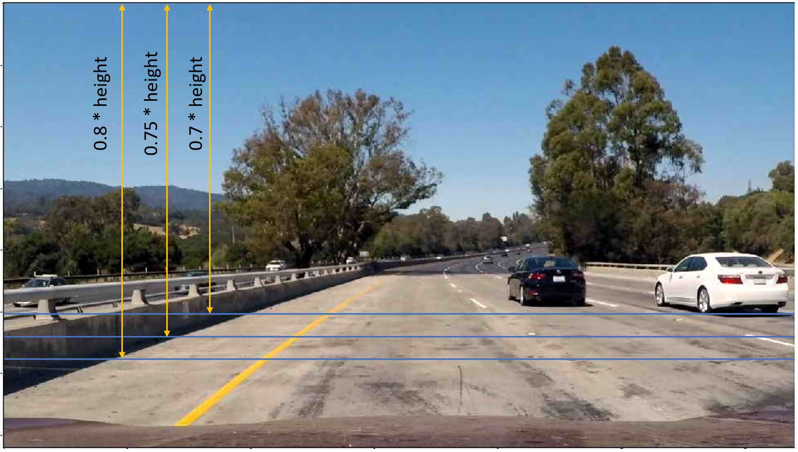
  * The following image shows that the grayscale cannot provide enough gradient information to detect the lane in this scenario.
  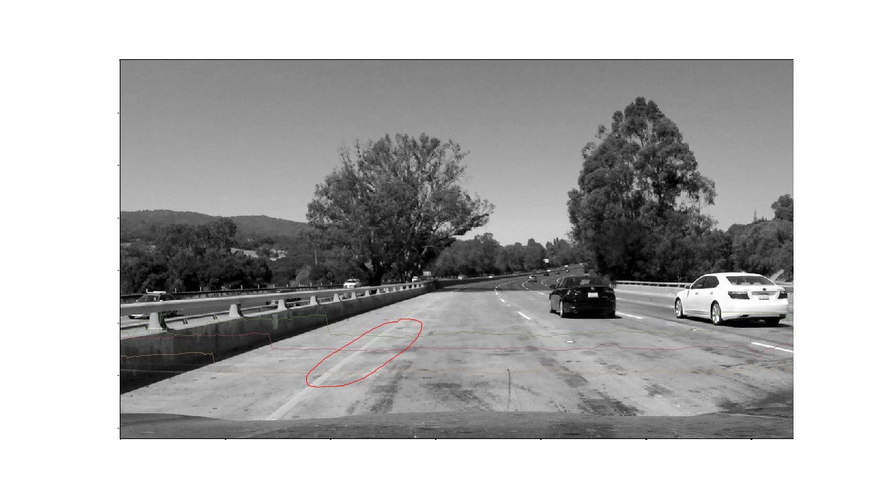
  * The V channel of the image provide better gradient information to distinguish the lane from the background compared with the grayscale image.
  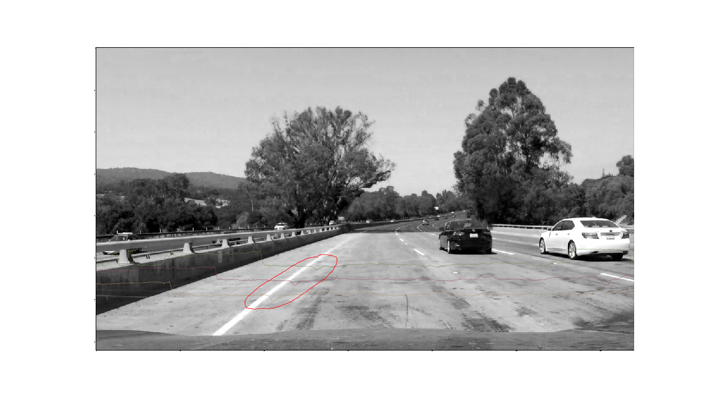

2. Gaussian blur the V channel image (**kernel size = 3**)
  ```python
  # Gaussian blur
  gaussian = gaussian_blur(V, gaussian_kernel_size)
  ```
  * Reason:
  Detecting the solid lanes are easier than detecting the broken lanes, thus my main focus is finding the threshold to distinguish the broken lane markings from the background. Gaussian blur is used to eliminate the high-frequency noise in the image, however, large Gaussian kernel size not only remove the noise but also blur the broken lane markings. 
  
  * I tested different Gaussian kernel size and picked the kernel size 3. It eliminate part of those unwanted high-frequency noise on the road while preserve the clearness of the broken lane markings
  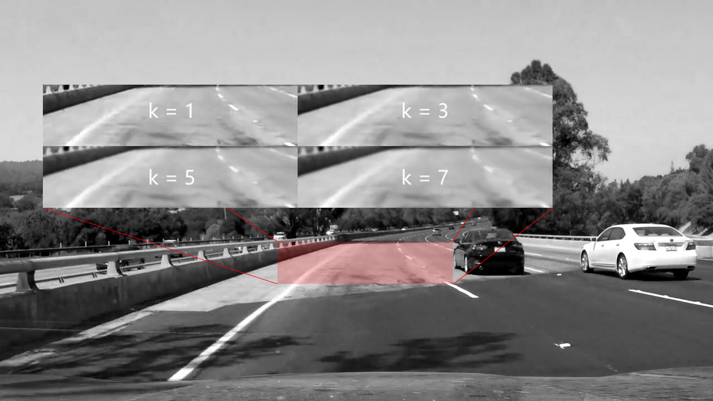

3. Use Canny edge detector to extract the edges from the image (**low threshold = 90, high threshold = 150**)
  ```python
  # Canny edge detection
  edges = canny(gaussian, canny_low_threshold, canny_high_threshold)
  ```
  * Reason: To determine the proper thresholds of the Canny edge detector, I draw all edges with different gradient thresholds. 
  
  * In the following examples, red edges (50 - 100), purple edges (100 - 150), white edges (> 150)
  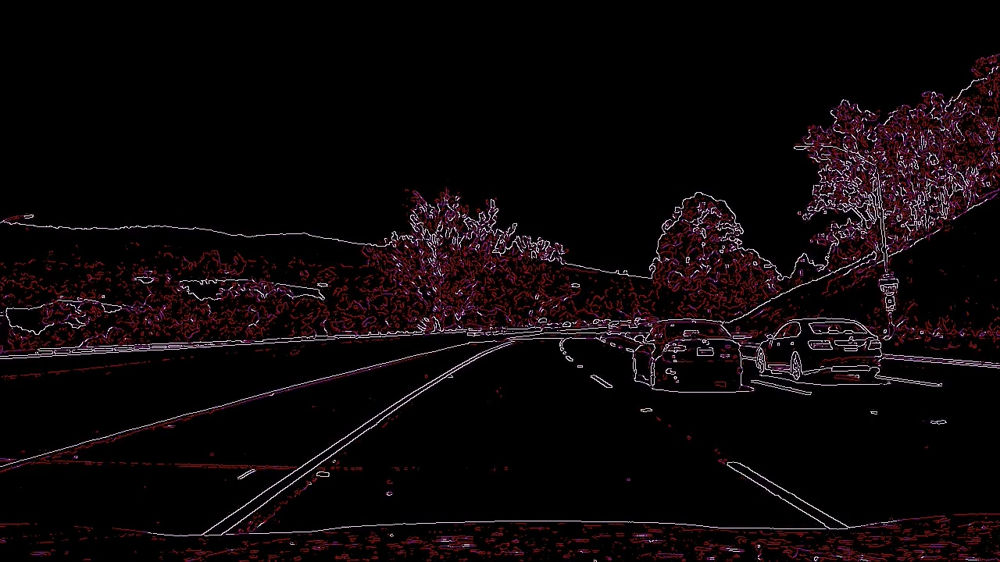
  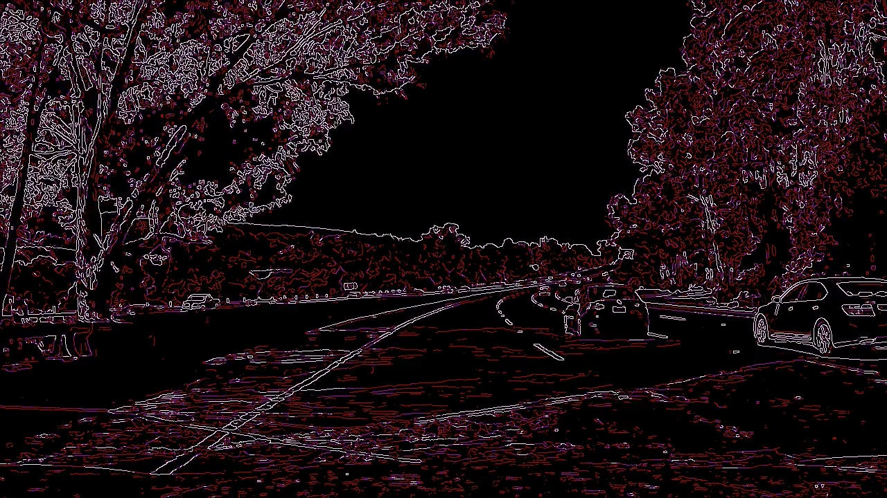
  
  * In the Canny edge detector, the edges satisfying high threshold are used as the seed to link those edges satisfying low threshold. Thus, the high threshold should be set to a relatively high value to eliminate noise while low enough to preserve capability that generate the edge seeds on the lane. The low threshold should be set to a high value to eliminate noise while still capable to capture the complete lane (Like the following scenario).
  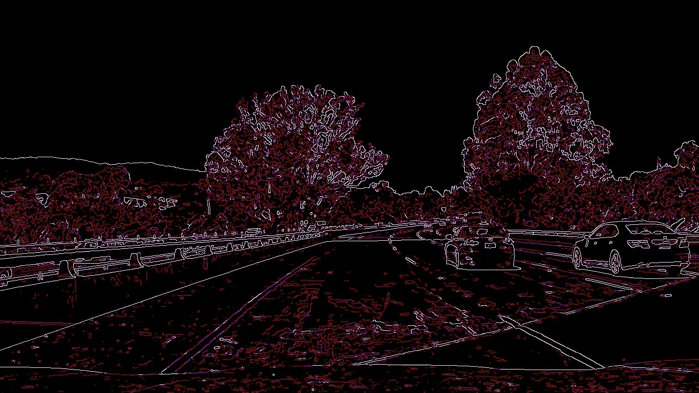
  
4. Use a Region of Interest mask to remove non-relevent area 

  ```python
  # Define a convex polygon mask for the Region of Interest
  imshape = image.shape
    
  left_bottom_point = [np.round(0.05 * imshape[1]).astype(int), np.round(0.95 * imshape[0]).astype(int)]
  left_top_point = [np.round(0.46*imshape[1]).astype(int), np.round((0.63)*imshape[0]).astype(int)]
  right_top_point = [np.round(0.54*imshape[1]).astype(int), np.round((0.63)*imshape[0]).astype(int)]
  right_bottom_point = [np.round(0.95 * imshape[1]).astype(int), np.round(0.95 * imshape[0]).astype(int)]
    
  #Convert to tuple
  left_bottom_point = tuple(left_bottom_point)
  left_top_point = tuple(left_top_point)
  right_top_point = tuple(right_top_point)
  right_bottom_point = tuple(right_bottom_point)
    
  RoI_vertices = np.array([[left_bottom_point, left_top_point, right_top_point, right_bottom_point]], dtype=np.int32)
  ```

  ```python
  # Region of Interest
  RoI = region_of_interest(edges, RoI_vertices)
  ```
  
  * Reason: The geometry and position of the region of interest is highly dependent on the position of the camera. 
  
  * Vertical shift and horizontal shift are added in the *challenge.mp4* test case to guarantee the lanes stay in the center of the region of interest.
  
  ```python
  horizontal_shift = np.round(0.02 * imshape[1]).astype(int)
  left_bottom_point[0] += horizontal_shift
  left_top_point[0] += horizontal_shift
  right_top_point[0] += horizontal_shift
  right_bottom_point[0] += horizontal_shift
    
  vertical_shift = -1 * np.round(0.025 * imshape[0]).astype(int)
  left_bottom_point[1] += vertical_shift
  left_top_point[1] += vertical_shift
  right_top_point[1] += vertical_shift
  right_bottom_point[1] += vertical_shift    
  ```
  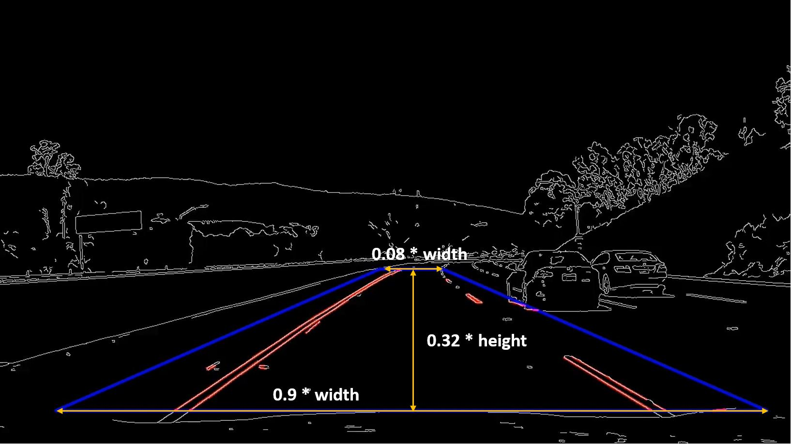
  
5. Use Hough line transform to detect the line segments from the images, **rho = 2, theta = np.pi/180, threshold = 35, min line len = 5, max line gap = 10**
  ```python
  # Detect lines by using probabilistic Hough Line Transform   
  lines = hough_lines(RoI, hough_rho, hough_theta, hough_threshold, hough_min_line_len, hough_max_line_gap)
  ```
  * Reason: I begin with a set of relatively loose parameters that allow the Hough line transform capture the targeted line segments robustly. Then I observe the difference between the targeted line segments and the noisy line segments then narrow down the range of parameters.

  * The Hough line transform provide good results when testing with the test images.
  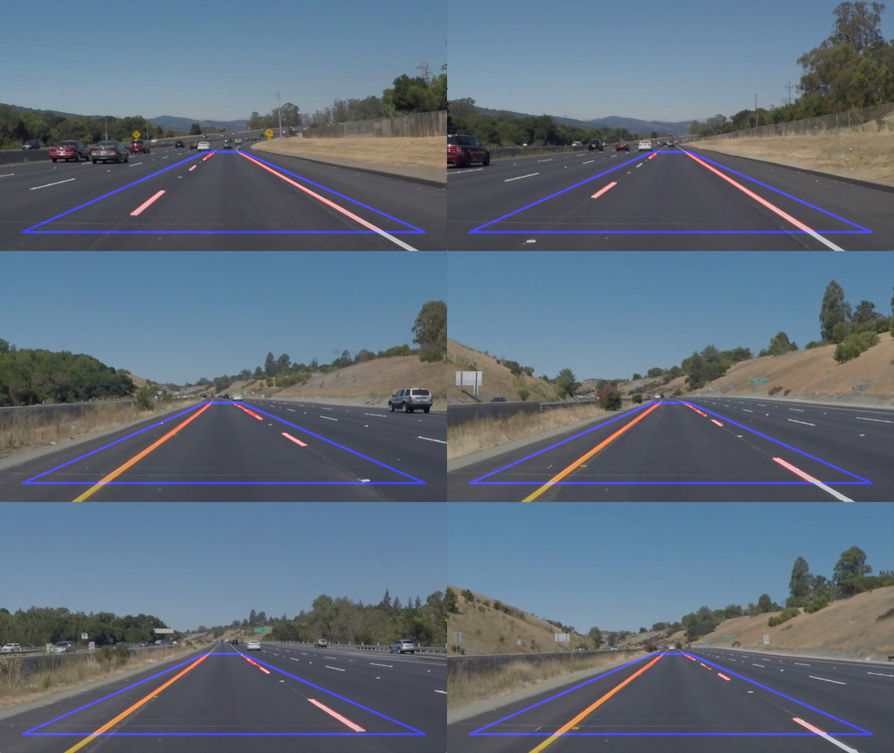

---
### For simple scenarios, the previous five steps can do the job. However, in complex scenarios (like tree shadow or damaged road), lots of errors can be observed. If use more strict parameters, the broken lane markings can not be distinguished from the road background. Therefore, five extra steps have been added to the draw_lines() function for obtain better result.
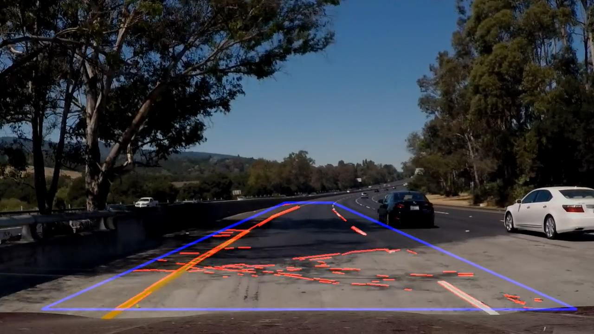

1. Remove semi-vertical and semi-horizontal line segments

2. Seperate line segments of the left lanes and the right lanes
3. Use another Hough transform on the left and right lane segments to suppress the noise and intensify the lane marking.
4. Filter the line segments by detecting the dense slope interval and dense x coordinates interval.
5. Compute length-weighted x_top and x_bottom as the prediction of lane.

```python
def draw_lines(img, lines, color=[255, 0, 0], thickness=10):

    # 1. Remove semi-vertical and semi-horizontal line segments
    lines = remove_vertical_and_horizontal_lines(lines, img, vertical_angle=15,
                                                 horizontal_angle=35)
												 
    # 2. Seperate left and right lane segments
    left_lane_segments, right_lane_segments = seperate_left_and_right_lanes(lines, img)
    
    # Parameters for the second Hough transform
    hough_rho = 8
    hough_theta = np.pi / 90
    hough_threshold = 350
    hough_min_line_len = 30
    hough_max_line_gap = 150
    
	# 3. Use second Hough transform on the left and right lane segments to extract the lanes.
    left_lane_segments = second_hough_transform(left_lane_segments, img,
                                                thickness=10, color=(255, 255, 255),
                                                hough_rho=hough_rho, hough_theta=hough_theta, 
                                                hough_threshold=hough_threshold, hough_min_line_len=hough_min_line_len,
                                                hough_max_line_gap=hough_max_line_gap)
    
    right_lane_segments = second_hough_transform(right_lane_segments, img,
                                                thickness=10, color=(255, 255, 255),
                                                hough_rho=hough_rho, hough_theta=hough_theta, 
                                                hough_threshold=hough_threshold, hough_min_line_len=hough_min_line_len,
                                                hough_max_line_gap=hough_max_line_gap)
												
    # y_bot, y_top for extrapolate line segments
    y_bot = np.round(img.shape[0] * 0.95).astype(int)
    y_top = np.round(img.shape[0] * 0.6).astype(int)

	# Detect lanes from line segments
    if left_lane_segments is not None :
        left_lane = detect_lane_from_segments(img, left_lane_segments, y_bot=y_bot, y_top=y_top)
    
    if right_lane_segments is not None :
        right_lane = detect_lane_from_segments(img, right_lane_segments, y_bot=y_bot, y_top=y_top)
    
    # Draw lanes
    if left_lane != None:
        cv2.line(img, (left_lane[0], left_lane[1]), (left_lane[2], left_lane[3]), color, thickness)
        pass
    if right_lane != None:
        cv2.line(img, (right_lane[0], right_lane[1]), (right_lane[2], right_lane[3]), color, thickness)
        pass
```

1. Remove semi-vertical and semi-horizontal line segments 
  * Reason: To filter these unwanted line segments, I set a criteria that remove all semi-vertical and semi-horizontal line segments (angle less than 20 degrees). 
  
  ```python
	def remove_vertical_and_horizontal_lines(lines, img, angle=20):
		"""
		Remove the vertical and horizontal line segments
		"""
		
		RAD_TOL = angle / 180 * np.pi
		TOL = np.sin(RAD_TOL)
		
		result = []
		
		for line in lines:
			for x1,y1,x2,y2 in line:         
				length = np.sqrt((x2-x1)**2 + (y2-y1)**2)
				
				# Eliminate all vertical and horizontal lines
				if (np.abs(x2 - x1) / length < TOL) or (np.abs(y2 - y1) / length < TOL):
					continue               
				
				result.append([[x1, y1, x2, y2]])

		return result
  ```
  
2. Seperate line segments of the left lane and the right lane
  * Seperate the line segments by their mid point x coordinates and slope.
  
  ```python
	def seperate_left_and_right_lanes(lines, img):
		"""
		Seperate the left lane segments and right lane segments
		"""
		img_x_mid = img.shape[1] / 2
		
		left_lane_segments = []
		right_lane_segments = []

		for line in lines:
			for x1,y1,x2,y2 in line:            
				slope = (y2 - y1) / (x2 - x1)
				x_mid = (x1 + x2) / 2
				
				# Seperate the line belongs to left lane or right lane
				# Negative slope and on the left side => left lane
				if slope < 0 and x_mid < img_x_mid:
					left_lane_segments.append([[x1, y1, x2, y2]])
					#cv2.line(img, (x1, y1), (x2, y2), (0, 255, 0), 2)
				# Positive slope and on the right side => right lane
				elif slope > 0 and x_mid > img_x_mid:       
					right_lane_segments.append([[x1, y1, x2, y2]])
					#cv2.line(img, (x1, y1), (x2, y2), (255, 0, 255), 2)
				else:
					pass

		return left_lane_segments, right_lane_segments
  ```
  
  * The following image is the result after first two extra steps. the left lane segments are drawed in green and the right lane segments are drawed in purple.
  
  
3. Use another Hough transform on the left and right lane segments to suppress the noise and intensify the broken lane marking.
  * Reason: If use only one single Hough transform, the broken lane markings could be flooded by background noise on the road, since both of them are short line segments. Compared with the background noise, the line segments belonging to the broken lane marking have strong direction consistency along the broken lane markings. Therefore, the broken lane markings can be distinguished from the background noise by using another Hough transform.
  
    * Left and Right lane segments from previous step.
    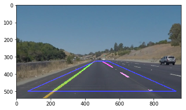
  
    ```python
	def second_hough_transform(lane_segments,
                           img,
                           draw_thickness = 10,
                           draw_color = (255,255,255),
                           hough_rho = 8,
                           hough_theta = np.pi / 90,
                           hough_threshold = 350,
                           hough_min_line_len = 30,
                           hough_max_line_gap = 150):
    
    # Draw left lane and right lane segments on empty images
    lane_image = draw_line_segments(lane_segments, img, thickness=draw_thickness, color=draw_color)
    
    # Use another Hough transform 
    lane_image = grayscale(lane_image)
    second_lane_segments = cv2.HoughLinesP(lane_image, hough_rho, 
                                           hough_theta, hough_threshold, 
                                           np.array([]), hough_min_line_len, 
                                           hough_max_line_gap)
    
    return second_lane_segments
	```
  
  * #1 The lane segments are drawed on an empty image (**thickness = 10**), the thickness set to a high value so the adjacent lines are merged.

    ```python
	def draw_line_segments(segments, img, color=(255, 255, 255), thickness = 10):
	    """
		Draw all line segments on an empty image and return it.
		"""
		# if segments is empty
		if segments is None:
			return None
		
		# Create empty image
		result = np.zeros_like(img)
		
		for line in segments:
			for x1,y1,x2,y2 in line:
				cv2.line(result, (x1, y1), (x2, y2), color, thickness)

		return result
    ```
	
    * The left lane image and the right lane image.
    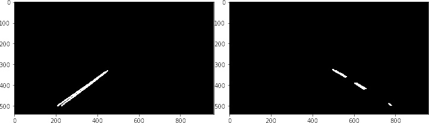
  * #2 Use another Hough transform on the lane image (**hough_rho = 8, hough_theta = np.pi/90, hough_threshold = 350, hough_min_line_len = 30, hough_max_line_gap = 150**). hough_rho and hough_theta set to high values that allow the adjacent line segments vote for the same line. The hough_threshold also set to a very high value thus only those line segments have strong direction consistency can pass the threshold and considered as a line.
    * Use Hough transform on the lane images to extract the lanes.
    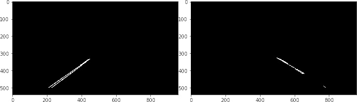

4. Filter the line segments by detecting the dense intervals of the slope and x coordinates.
  * Reason: Extrapolate all line segments to y_top and y_bottom, the x_top and x_bottom of line segments belonging to broken lane marking form an dense region. The line segments can be filtered by removing line segments not in the dense region.
  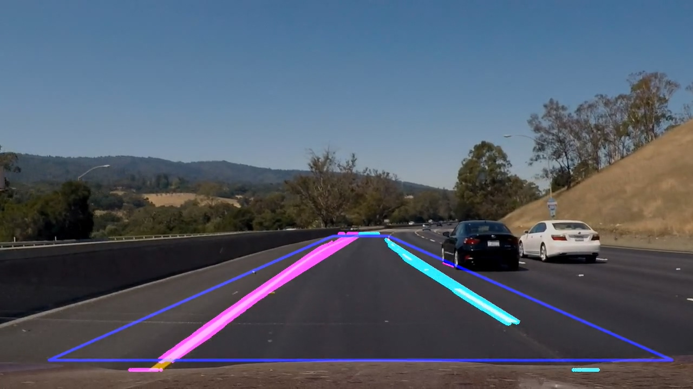
    ```python
	
	# Extrapolate line segments to y_top and y_bot. Compute length and slope for each line segments
	x_bots, x_tops = extrapolate_lines(lane_segments, img, y_bot=y_bot, y_top=y_top)

    x_bots = np.array(x_bots)
    x_tops = np.array(x_tops)
	
    # Filter by x_top coordinates
	# Find minimum interval covering 70% of line segments
    n = np.ceil(x_bots.shape[0] * 0.7).astype(int)
    x_top_low, x_top_high = find_min_interval_of_n_elements_in_a_sorted_array(x_tops[:, 0], n)
    mask = np.logical_and(x_tops[:, 0] >= x_top_low, x_tops[:, 0] <= x_top_high)
    x_bots = x_bots[mask, :]
    x_tops = x_tops[mask, :]
    ```
  
  * The line segments can also be filtered by their slopes.
    ```python
    # filter by slope (x_tops[:, 2] are slopes)
    n = np.ceil(x_bots.shape[0] * 0.5).astype(int)
    x_top_slope_low, x_top_slope_high = find_min_interval_of_n_elements_in_a_sorted_array(x_tops[:, 2], n)
    mask = np.logical_and(x_tops[:, 2] >= x_top_slope_low, x_tops[:, 2] <= x_top_slope_high)
    x_bots = x_bots[mask, :]
    x_tops = x_tops[mask, :]
    ```
  
5. Compute length-weighted x_top and x_bottom as the prediction of lane.
  ```python
    if x_bots.size != 0:
		# x_bots[:, 0] are extrapolated x coordinates, x_bots[:, 1] are the length of corresponding line segments.
        x_bot = np.round(np.average(x_bots[:, 0], weights=x_bots[:, 1])).astype(int)
        x_top = np.round(np.average(x_tops[:, 0], weights=x_tops[:, 1])).astype(int)

        lane = [x_bot, y_bot, x_top, y_top]
  ```


### 2. Identify potential shortcomings with your current pipeline


One potential shortcoming would be what would happen when ... 

Another shortcoming could be ...


### 3. Suggest possible improvements to your pipeline

A possible improvement would be to ...

Another potential improvement could be to ...