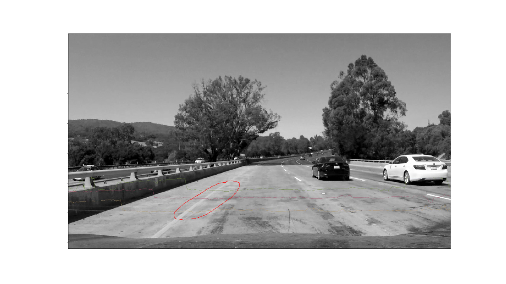
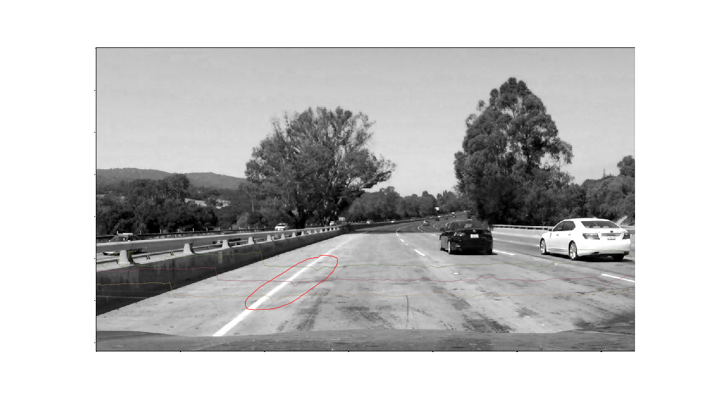

# **Finding Lane Lines on the Road** 

## Xinlin's report

### You can use this file as a template for your writeup if you want to submit it as a markdown file. But feel free to use some other method and submit a pdf if you prefer.

---

**Finding Lane Lines on the Road**

The goals / steps of this project are the following:
* Make a pipeline that finds lane lines on the road
* Reflect on your work in a written report

---

# Reflection

## 1. Describe your pipeline. As part of the description, explain how you modified the draw_lines() function.

My pipeline consisted of 5 steps. 

1. Convert the images from **RGB** space to **HSV** space, and use **V channel** instead of **grayscale** image.

```python
# Convert image color space to HSV space
HSV = cv2.cvtColor(image, cv2.COLOR_RGB2HSV)

H = HSV[:,:,0]
S = HSV[:,:,1]
V = HSV[:,:,2]
```

*  Reason:
In my initial solution, I use grayscale image. However, it works very bad in the challenge part. I found that the grayscale image can not provide enough gradient information to distinguish the lane from background in this scenario. Especially after gaussian blur. So I decided to switch to HSV space.

* The intensity of the grayscale image and the V channel image were plotted along these three lines to show the difference.

* The following image shows that the grayscale cannot provide enough gradient information to detect the lane in this scenario.

* The V channel of the image provide better gradient information to distinguish the lane from the background compared with the grayscale image.


2. Step 

In order to draw a single line on the left and right lanes, I modified the draw_lines() function by ...

If you'd like to include images to show how the pipeline works, here is how to include an image: 

![alt text][image1]


###2. Identify potential shortcomings with your current pipeline


One potential shortcoming would be what would happen when ... 

Another shortcoming could be ...


###3. Suggest possible improvements to your pipeline

A possible improvement would be to ...

Another potential improvement could be to ...